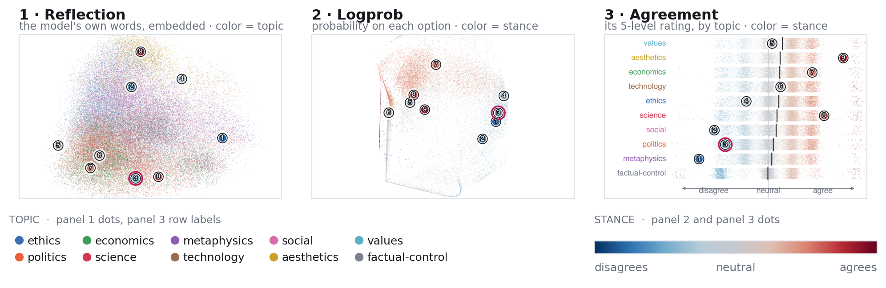
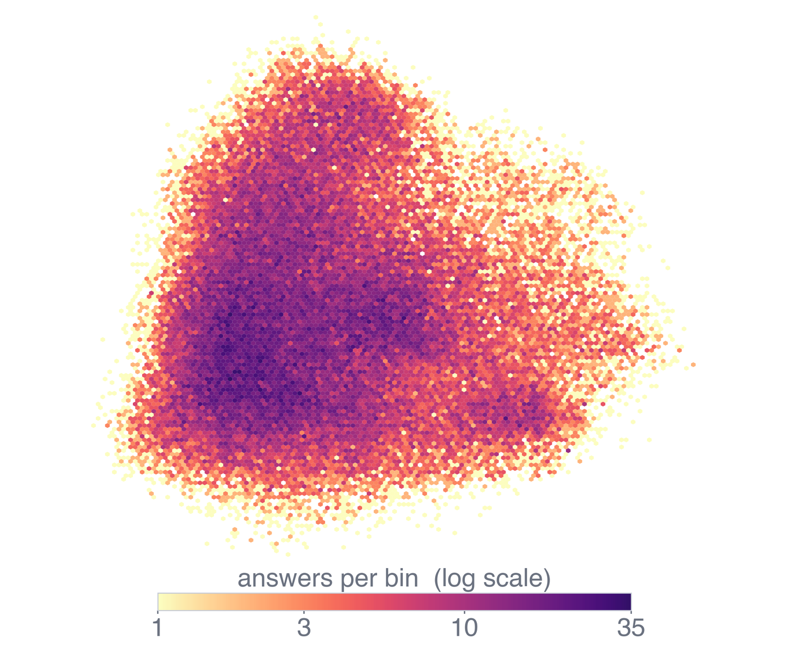

# `images/` — the figures used in the README

Two figures. Both are rendered from the real 76,048-answer corpus in [`../data/`](../data/), and both
are the versions that appear on the **IEEE VIS 2026 display poster** — not the ones in the two-page
paper, which are laid out differently.

---

## `three-channels.png`

The poster's main figure: the same 76,048 answers arranged three ways, side by side.

- **Panel 1, Reflection** — position comes from the model's own written justification, embedded and
  projected to 2-D. Colour is the **topic**.
- **Panel 2, Logprob** — position comes from the probabilities it placed on each answer option.
  Colour is the **stance**, which runs across this layout as a direction rather than a clean gradient.
- **Panel 3, Agreement** — the agreement channel's stance, spread with one row per topic. The black
  tick on each row is that topic's mean stance. Colour of the dots is stance; the row *labels* are
  topic-coloured.

**The nine numbered rings are the same nine beliefs in every panel.** They are the reason the figure
is worth looking at: each ring is one dot, so its stance is by construction the same number in all
three, and yet it lands somewhere completely different in each layout. That disagreement between
panels is what the project measures.

Panel 3 is a **constructed** stance-by-topic layout, not the projected agreement geometry. The real
agreement projection is near-degenerate (96.79% of variance on one component) and would be a
featureless line; see [`../data/atlas/README.md`](../data/atlas/README.md#what-the-derived-arrays-are).

The domain legend and the stance bar are drawn into this image as pixels. On the printed poster they
are live vector text below the panels, and the panel titles sit below each panel rather than above
it, so the poster and this file are laid out slightly differently while showing the same three
panels.

## `density.png`

A log-scaled hexbin of the reflection layout — the same points as panel 1, counted per bin instead of
drawn individually. All 76,048 answers are binned, and the full cloud is in frame.

Past roughly one dot per pixel a scatterplot stops showing how many points are somewhere and starts
showing which point happened to be drawn last. This counts instead. The colour bar gives the scale:
pale yellow is a bin holding one answer, dark purple is a bin holding up to 35, and the mapping is
logarithmic because the range is wide. Any claim about where the cloud is dense should be read off
this, not off the scatterplots.

This is a matplotlib hexbin computed offline. It stands in for the instrument's GPU density mode; it
is not a capture of it.

---

## Where they come from

Both are generated from the corpus by a script kept with the poster sources, so they can be rebuilt
and stay consistent with the printed sheet:

- the three panels by `make_poster_figs_light.py`, which asserts it is reading the real 76,048-answer
  corpus and refuses to render from anything else;
- this composition and the density figure by `make_readme_figs.py`.

Neither script ships in this release, and neither is needed to check the figures: every value in
them comes from [`../data/`](../data/). Panel 1 and the density plot read `pos_reflection.bin`
directly — the snippet in
[`../data/atlas/README.md`](../data/atlas/README.md#pos_reflectionbin) redraws panel 1's point cloud
in a few lines, in matplotlib's default colours and without the nine anchors. Panels 2 and 3 need the
logprob and agreement layouts, which are not shipped; run the
[rebuild recipe](../data/atlas/README.md#the-rebuild-recipe) first and they come back exactly.

Colours are shared with the poster: a ten-entry categorical palette for topics and a diverging
blue-to-red ramp for stance, with the neutral midpoint darkened so a neutral stance still leaves ink
on a white page.

**A colour-vision note.** The stance ramp survives colour-vision deficiency — it runs dark at both
extremes through a light neutral, so the *strength* of a stance reads even where hue does not. The
ten topic colours do **not**: no palette separates ten categories under red-green deficiency, and
several pairs collide. Read panel 1 against the legend rather than by hue alone; panel 3 labels every
row directly.

Licensed CC BY 4.0 — see [LICENSE](../LICENSE).
